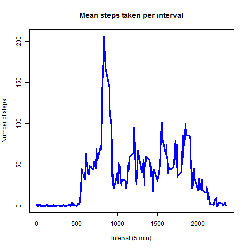
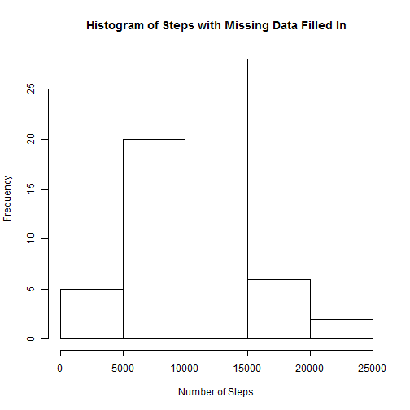
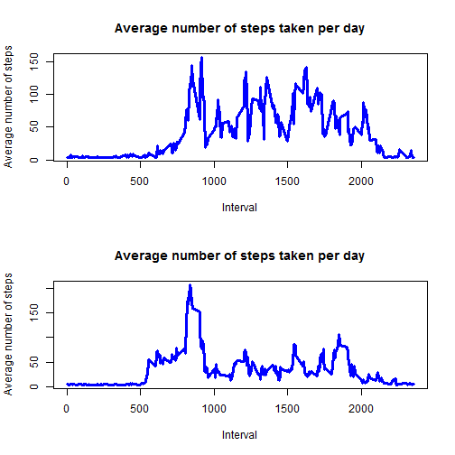

# Week to week fitness activity
This report analyzes anonymous fitness data from one person over 2 months to answer various activity questions. 

## Loading and preprocessing the data
The data is from a personal activity monitoring device that collected data from an anonymous individual collected during October and November 2012. The data include the number of steps taken in 5 minute intervals each day.

The first step is to load the necessary libraries and read in the data.

```r
library(lattice)
df = read.csv("activity.csv")
```
The variables included in this dataset are:
* steps: Number of steps taking in a 5-minute interval (missing values are coded as NA)
* date: The date on which the measurement was taken in YYYY-MM-DD format
* interval: Identifier for the 5-minute interval in which measurement was taken

The dataset is stored in a comma-separated-value (CSV) file and there are a total of 17,568 observations in this dataset.

## Perform exploratory data analysis
### Mean total number of steps taken per day
First determine the total number of steps taken per day and plot the results in a histogram. Then calculate the mean and median for daily number of steps.

```r
totalSteps = aggregate(steps ~ date, df, sum)
hist(totalSteps$steps, main = "Histogram of steps", xlab = "Steps Taken Per Day", ylab = "Frequency")
```


```r
steps_mean = mean(totalSteps$steps, na.rm=TRUE)
steps_median = median(totalSteps$steps, na.rm=TRUE)
print(paste("Mean daily number of steps is", steps_mean))
```

```
## [1] "Mean daily number of steps is 10766.1886792453"
```

```r
print(paste("Median daily number of steps is", steps_median))
```

```
## [1] "Median daily number of steps is 10765"
```


### Patterns of Average Daily Activity
Next, average the intervals across all days, and plot the results. Then determine which interval has the maximum of steps taken, on average.

```r
stepsInterval_mean = aggregate(steps ~ interval, df, mean)
plot(stepsInterval_mean$interval, stepsInterval_mean$steps, type="l",
     main="Mean steps taken per interval", 
     xlab="Interval (5 min)", ylab="Number of steps", 
     lwd=3, col="blue")
```



```r
stepsInterval_max = stepsInterval_mean$interval[stepsInterval_mean$steps == max(stepsInterval_mean$steps)]
print(paste("Maximum average number of steps is interval", stepsInterval_max))
```

```
## [1] "Maximum average number of steps is interval 835"
```

## Imputing missing values
Compare the above results with data that has the missing data filled in. Plot the results and find the mean and median.

```r
missing = is.na(df$steps)
print(paste("The number of intervals missing values is", sum(missing)))
```

```
## [1] "The number of intervals missing values is 2304"
```

```r
overallStepsInterval_mean = steps_mean/(length(df$interval)/length(totalSteps$date))
dfNew = df
dfNew$steps[is.na(dfNew$steps)] = (overallStepsInterval_mean)

totalStepsNew = aggregate(steps ~ date, dfNew, sum)

hist(totalStepsNew$steps, main = "Histogram of Steps with Missing Data Filled In", xlab = "Number of Steps", ylab = "Frequency")
```



```r
stepsNew_mean = mean(totalStepsNew$steps)
stepsNew_median = median(totalStepsNew$steps)
print(paste("Mean daily number of steps with missing data filled in is", stepsNew_mean))
```

```
## [1] "Mean daily number of steps with missing data filled in is 10581.013705993"
```

```r
print(paste("Median daily number of steps with missing data filled in is", stepsNew_median))
```

```
## [1] "Median daily number of steps with missing data filled in is 10395"
```

Comparing these results to the earlier mean and median there is little difference made by filling in the values; there's a slight decrease in mean and median with the data filled in.

## Determine if there differences in activity patterns between weekdays and weekends
Classify the weekend and weekdays, separate the data, find the mean number of steps per interval, and plot the results in a panel of two time series plots.

```r
dfNew$date = as.Date(dfNew$date)
weekday = c("Monday","Tuesday","Wednesday","Thursday","Friday")

dfNew$day = factor((weekdays(dfNew$date) %in% weekday), levels=c(FALSE, TRUE), labels=c('weekend', 'weekday'))

meanStepsWeekend = aggregate(steps ~ interval, dfNew[dfNew$day == "weekend",], mean)
meanStepsWeekday = aggregate(steps ~ interval, dfNew[dfNew$day == "weekday",], mean)
par(mfcol=c(2,1))

plot(meanStepsWeekend$interval, meanStepsWeekend$steps, type="l",
     main="Average number of steps taken per day", 
     xlab="Interval", ylab="Average number of steps", 
     lwd=3, col="blue")

plot(meanStepsWeekday$interval, meanStepsWeekday$steps, type="l",
    main="Average number of steps taken per day", 
    xlab="Interval", ylab="Average number of steps", 
    lwd=3, col="blue")
```



From the plots there are differences in weekday versus weekend activity. Activity is more rigourous early in the day on weekdays as well as consistant activity during the weekends. Thus weekday and weekend activities are different.
